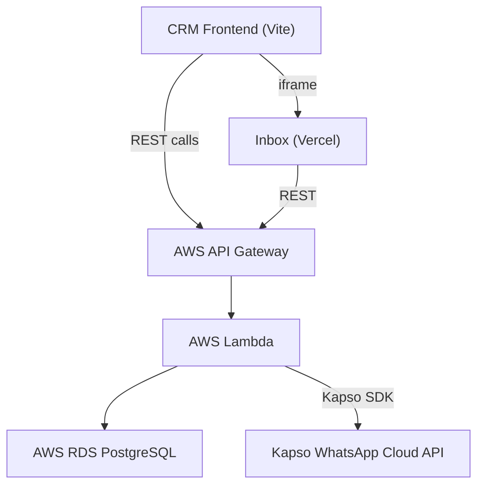

# CRM 2.0 — WhatsApp Integration Execution Plan

> **Infrastructure:** AWS (RDS PostgreSQL + API Gateway + Lambda)
> **Status:** 🟡 Planning Complete — Awaiting Execution
> **Last Updated:** 2026-04-30

---

## Architecture Overview



**Key Design Decision:** All WhatsApp notifications go through a single AWS Lambda endpoint (`POST /notify`), keeping the Kapso API key server-side and centralizing notification logic.

---

## WhatsApp Templates Required

Before building, these templates must be created and approved in the Kapso dashboard.

| # | Template Name | Trigger | Variables | Status |
|---|---|---|---|---|
| T1 | `lawyer_assigned` | Lawyer assigned to lead/ticket | `name`, `service`, `lawyer_name` | `[ ]` Create & submit |
| T2 | `payment_confirmed` | Payment recorded | `name`, `amount`, `ticket_id` | `[ ]` Create & submit |
| T3 | `draft_ready` | Draft sent to client | `name`, `service`, `ticket_id` | `[ ]` Create & submit |
| T4 | `case_completed` | Ticket archived | `name`, `service` | `[ ]` Create & submit |
| T5 | `client_nudge` | Client not responding | `name`, `service` | `[ ]` Create & submit |
| T6 | `welcome_message` | New lead created | `name`, `service` | `[ ]` Create & submit |
| T7 | `followup_reminder` | Follow-up due (auto) | `name`, `service` | `[ ]` Create & submit |
| T8 | `approval_needed` | Ticket sent for approval | `ticket_id`, `client_name` | `[ ]` Create & submit |
| T9 | `ticket_approved` | Ticket approved | `ticket_id` | `[ ]` Create & submit |
| T10 | `ticket_rejected` | Ticket rejected | `ticket_id`, `reason` | `[ ]` Create & submit |
| T11 | `feedback_request` | 24h after case completion | `name`, `service` | `[ ]` Create & submit |

---

# PHASE 1 — Foundation

> Chat assignment database, notification engine, and lawyer assignment workflow.
> This is the infrastructure ALL other phases depend on.

---

## Step 1.1: Database Schema

### 1.1.1 — Create `chat_assignments` table in AWS RDS
- `[ ]` Connect to RDS instance
- `[ ]` Run the following SQL:

```sql
CREATE TABLE chat_assignments (
    id SERIAL PRIMARY KEY,
    phone_number VARCHAR(20) NOT NULL,
    lawyer_id VARCHAR(100) NOT NULL,
    lawyer_name VARCHAR(200),
    lead_id VARCHAR(100),
    ticket_id VARCHAR(20),
    client_name VARCHAR(200),
    service_type VARCHAR(50),
    assigned_by VARCHAR(200),
    assigned_at TIMESTAMP DEFAULT NOW(),
    notification_sent BOOLEAN DEFAULT FALSE,
    notification_sent_at TIMESTAMP,
    active BOOLEAN DEFAULT TRUE,
    revoked_at TIMESTAMP,
    revoked_by VARCHAR(200),
    revoke_reason VARCHAR(200)
);

CREATE INDEX idx_chat_assignments_phone ON chat_assignments(phone_number);
CREATE INDEX idx_chat_assignments_lawyer ON chat_assignments(lawyer_id);
CREATE INDEX idx_chat_assignments_active ON chat_assignments(active);
```

- `[ ]` Verify table creation with `\dt chat_assignments`

### 1.1.2 — Create `notification_log` table in AWS RDS
- `[ ]` Run the following SQL:

```sql
CREATE TABLE notification_log (
    id SERIAL PRIMARY KEY,
    phone_number VARCHAR(20) NOT NULL,
    template_name VARCHAR(100) NOT NULL,
    template_params JSONB,
    status VARCHAR(20) DEFAULT 'pending',
    kapso_message_id VARCHAR(100),
    error_message TEXT,
    triggered_by VARCHAR(200),
    trigger_source VARCHAR(100),
    created_at TIMESTAMP DEFAULT NOW()
);

CREATE INDEX idx_notification_log_phone ON notification_log(phone_number);
CREATE INDEX idx_notification_log_status ON notification_log(status);
```

- `[ ]` Verify table creation

---

## Step 1.2: AWS Lambda — Notification Engine

### 1.2.1 — Create `notify` Lambda function
- `[ ]` Create new Lambda function `vakiltech-notify`
- `[ ]` Set environment variables:
  - `KAPSO_API_KEY`
  - `PHONE_NUMBER_ID`
  - `DB_HOST`, `DB_PORT`, `DB_NAME`, `DB_USER`, `DB_PASSWORD`
- `[ ]` Install dependencies: `pg`, `node-fetch` (or use built-in `https`)

### 1.2.2 — Implement `POST /notify` handler
- `[ ]` Accept body: `{ type, phone_number, params, api_key }`
- `[ ]` Validate `api_key` against env `NOTIFY_API_KEY`
- `[ ]` Template mapping:

```javascript
const TEMPLATE_MAP = {
  'lawyer_assigned':       { template: 'lawyer_assigned', params: ['name', 'service', 'lawyer_name'] },
  'payment_confirmed':     { template: 'payment_confirmed', params: ['name', 'amount', 'ticket_id'] },
  'draft_ready':           { template: 'draft_ready', params: ['name', 'service', 'ticket_id'] },
  'case_completed':        { template: 'case_completed', params: ['name', 'service'] },
  'client_nudge':          { template: 'client_nudge', params: ['name', 'service'] },
  'welcome_message':       { template: 'welcome_message', params: ['name', 'service'] },
  'followup_reminder':     { template: 'followup_reminder', params: ['name', 'service'] },
  'approval_needed':       { template: 'approval_needed', params: ['ticket_id', 'client_name'] },
  'ticket_approved':       { template: 'ticket_approved', params: ['ticket_id'] },
  'ticket_rejected':       { template: 'ticket_rejected', params: ['ticket_id', 'reason'] },
  'feedback_request':      { template: 'feedback_request', params: ['name', 'service'] },
};
```

- `[ ]` Send template message via Kapso API
- `[ ]` Log to `notification_log` table (success or failure)
- `[ ]` Return `{ success: true, message_id }` or `{ success: false, error }`

### 1.2.3 — Wire to API Gateway
- `[ ]` Add `POST /notify` route to existing API Gateway
- `[ ]` Test with curl:
```bash
curl -X POST https://YOUR_API/notify \
  -H "Content-Type: application/json" \
  -d '{"type":"lawyer_assigned","phone_number":"919876543210","params":{"name":"Test","service":"Legal Notice","lawyer_name":"Prachi"},"api_key":"YOUR_KEY"}'
```
- `[ ]` Verify message delivered in WhatsApp
- `[ ]` Verify log entry in `notification_log` table

---

## Step 1.3: AWS Lambda — Chat Assignment API

### 1.3.1 — Create `POST /chat-assignments` handler
- `[ ]` Accept body: `{ phone_number, lawyer_id, lawyer_name, lead_id, ticket_id, client_name, service_type, assigned_by, api_key }`
- `[ ]` Deactivate any existing active assignment for this `phone_number`
- `[ ]` Insert new active assignment
- `[ ]` Call the `/notify` endpoint internally with type `lawyer_assigned`
- `[ ]` Return `{ success: true, assignment_id }`

### 1.3.2 — Create `POST /chat-assignments/revoke` handler
- `[ ]` Accept body: `{ phone_number, reason, revoked_by, api_key }`
- `[ ]` Set `active = false`, `revoked_at = NOW()`, `revoked_by`, `revoke_reason`
- `[ ]` Return `{ success: true }`

### 1.3.3 — Create `GET /chat-assignments` handler
- `[ ]` Accept query: `?lawyer_id=xxx`
- `[ ]` Return all active assignments for that lawyer
- `[ ]` If `?lawyer_id=ALL`, return all active assignments (for admin)

### 1.3.4 — Wire to API Gateway
- `[ ]` Add routes: `POST /chat-assignments`, `POST /chat-assignments/revoke`, `GET /chat-assignments`
- `[ ]` Test all three endpoints with curl
- `[ ]` Verify data in `chat_assignments` table

---

## Step 1.4: CRM Integration — Lawyer Assignment

### 1.4.1 — Add notification helper to CRM
- `[ ]` Create `src/lib/inbox-api.ts` in `vakil-lead-flow`:

```typescript
const NOTIFY_URL = import.meta.env.VITE_NOTIFY_API_URL;
const NOTIFY_KEY = import.meta.env.VITE_NOTIFY_API_KEY;

export async function notifyClient(type: string, phoneNumber: string, params: Record<string, string>) {
  try {
    await fetch(`${NOTIFY_URL}/notify`, {
      method: 'POST',
      headers: { 'Content-Type': 'application/json' },
      body: JSON.stringify({ type, phone_number: phoneNumber, params, api_key: NOTIFY_KEY })
    });
  } catch (e) {
    console.error('Notification failed:', e);
  }
}

export async function assignChat(data: { phone_number: string; lawyer_id: string; lawyer_name: string; lead_id?: string; ticket_id?: string; client_name: string; service_type: string; assigned_by: string }) {
  try {
    await fetch(`${NOTIFY_URL}/chat-assignments`, {
      method: 'POST',
      headers: { 'Content-Type': 'application/json' },
      body: JSON.stringify({ ...data, api_key: NOTIFY_KEY })
    });
  } catch (e) {
    console.error('Chat assignment failed:', e);
  }
}

export async function revokeChat(phoneNumber: string, reason: string, revokedBy: string) {
  try {
    await fetch(`${NOTIFY_URL}/chat-assignments/revoke`, {
      method: 'POST',
      headers: { 'Content-Type': 'application/json' },
      body: JSON.stringify({ phone_number: phoneNumber, reason, revoked_by: revokedBy, api_key: NOTIFY_KEY })
    });
  } catch (e) {
    console.error('Chat revoke failed:', e);
  }
}
```

- `[ ]` Add env vars to `.env`: `VITE_NOTIFY_API_URL`, `VITE_NOTIFY_API_KEY`

### 1.4.2 — Hook into LeadDetail.tsx — Assign Lawyer dropdown
- `[ ]` Import `assignChat` and `revokeChat` from `inbox-api.ts`
- `[ ]` After `updateLeadInServer` succeeds in the lawyer dropdown `onValueChange`:
  - If `lawyerId` is set → call `assignChat()`
  - If `lawyerId` is null (unassigned) → call `revokeChat()`
- `[ ]` Test: Assign a lawyer to a lead → verify WhatsApp notification delivered

### 1.4.3 — Hook into LeadDetail.tsx — Payment Dialog
- `[ ]` After `addTicketToServer` succeeds in `handleConfirmPayment`:
  - Call `assignChat()` with `ticket_id` included
- `[ ]` Test: Record payment → verify notification + chat assignment

### 1.4.4 — Hook into TicketDetail.tsx — Lawyer Reassignment
- `[ ]` In the "Assigned Lawyer" `Select` `onValueChange` (line ~258):
  - After `updateTicketInServer` succeeds → call `assignChat()` with new lawyer
- `[ ]` Test: Reassign lawyer on ticket → verify old assignment revoked, new one created, notification sent

### 1.4.5 — Hook into TicketDetail.tsx — Archive/Complete
- `[ ]` In `handleStatusChange` (line ~76): if `finalStatus === 'ARCHIVED'`, call `revokeChat()`
- `[ ]` In "Approve & Archive" button (line ~378): after `updateTicketInServer` succeeds, call `revokeChat()`
- `[ ]` Test: Archive a ticket → verify lawyer's chat access revoked

---

## Step 1.5: Inbox Integration — DB-Backed ACL

### 1.5.1 — Update Inbox to fetch assignments from AWS
- `[ ]` In `whatsapp-cloud-inbox`, update `conversation-list.tsx`:
  - On mount, read `acl` and `lawyer_id` from URL params
  - If `acl=restricted`, call `GET /chat-assignments?lawyer_id=xxx`
  - Use returned phone numbers to filter conversations
- `[ ]` Update `Inbox.tsx` in CRM to pass `lawyer_id` in URL params

### 1.5.2 — Test end-to-end
- `[ ]` Login as admin → see all chats ✓
- `[ ]` Login as Prachi (front desk) → see all chats ✓
- `[ ]` Login as a lawyer → see only assigned chats ✓
- `[ ]` Assign new lead to lawyer → chat appears in their inbox ✓
- `[ ]` Archive ticket → chat disappears from lawyer's inbox ✓

### 1.5.3 — Push & deploy
- `[ ]` Push `whatsapp-cloud-inbox` changes → Vercel auto-deploys
- `[ ]` Push `vakil-lead-flow` changes

---

# PHASE 2 — High-Impact Client Notifications

> These directly improve client experience and reduce support queries.
> **Prerequisite:** Phase 1 complete (notification engine exists)

---

## Step 2.1: Payment Confirmation (#4 + #5)

### 2.1.1 — Create & submit template `payment_confirmed`
- `[ ]` Create in Kapso dashboard
- `[ ]` Wait for approval

### 2.1.2 — Hook into LeadDetail.tsx — handleConfirmPayment
- `[ ]` After ticket creation succeeds, call:
```typescript
notifyClient('payment_confirmed', lead.whatsapp_number, {
  name: lead.name,
  amount: amount.toLocaleString('en-IN'),
  ticket_id: ticketId
});
```
- `[ ]` Test: Record payment → verify client receives confirmation

---

## Step 2.2: Draft Ready Notification (#7)

### 2.2.1 — Create & submit template `draft_ready`
- `[ ]` Create in Kapso dashboard
- `[ ]` Wait for approval

### 2.2.2 — Hook into TicketDetail.tsx — Status Change
- `[ ]` In `handleStatusChange`, if new status is `DRAFT_SENT_TO_CLIENT`:
```typescript
const clientPhone = leads.find(l => l.id === ticket.client_id)?.whatsapp_number;
if (clientPhone) {
  notifyClient('draft_ready', clientPhone, {
    name: ticket.client_name,
    service: ticket.service_type,
    ticket_id: ticket.ticket_id
  });
}
```
- `[ ]` Test: Change ticket to "Draft Sent" → verify notification

---

## Step 2.3: Case Completed Notification (#11)

### 2.3.1 — Create & submit template `case_completed`
- `[ ]` Create in Kapso dashboard
- `[ ]` Wait for approval

### 2.3.2 — Hook into TicketDetail.tsx — Archive
- `[ ]` In `handleStatusChange`, if `finalStatus === 'ARCHIVED'`:
```typescript
const clientPhone = leads.find(l => l.id === ticket.client_id)?.whatsapp_number;
if (clientPhone) {
  notifyClient('case_completed', clientPhone, {
    name: ticket.client_name,
    service: ticket.service_type
  });
}
```
- `[ ]` Same in the "Approve & Archive" button handler
- `[ ]` Test: Archive ticket → verify client receives completion message

---

## Step 2.4: Client Not Responding Nudge (#8)

### 2.4.1 — Create & submit template `client_nudge`
- `[ ]` Create in Kapso dashboard
- `[ ]` Wait for approval

### 2.4.2 — Hook into TicketDetail.tsx — Status Change
- `[ ]` If new status is `CLIENT_NOT_RESPONDING`:
```typescript
notifyClient('client_nudge', clientPhone, {
  name: ticket.client_name,
  service: ticket.service_type
});
```
- `[ ]` Test: Change status to "Client Not Responding" → verify nudge sent

---

# PHASE 3 — Automated Follow-ups & Lead Onboarding

> Improve conversion rates and reduce manual front desk work.
> **Prerequisite:** Phase 1 complete

---

## Step 3.1: Welcome Message (#1)

### 3.1.1 — Create & submit template `welcome_message`
- `[ ]` Create in Kapso dashboard
- `[ ]` Wait for approval

### 3.1.2 — Hook into CRMContext.tsx — addLeadToServer
- `[ ]` After lead creation succeeds:
```typescript
notifyClient('welcome_message', leadData.whatsapp_number, {
  name: leadData.name,
  service: leadData.service
});
```
- `[ ]` Test: Create new lead → verify welcome message sent

---

## Step 3.2: Auto Follow-up Messages (#2)

### 3.2.1 — Create & submit template `followup_reminder`
- `[ ]` Create in Kapso dashboard
- `[ ]` Wait for approval

### 3.2.2 — Decide: Auto-send vs. One-click send
- `[ ]` **Option A (Recommended):** Add a "Send via WhatsApp" button next to each follow-up step that sends the template with one click (no copy-paste)
- `[ ]` **Option B:** Fully automated — Lambda cron job checks for due follow-ups and sends automatically

### 3.2.3 — Implement chosen option
- `[ ]` If Option A: Update `LeadDetail.tsx` follow-up section to add a WhatsApp send button per step
- `[ ]` If Option B: Create a scheduled Lambda that queries leads with due follow-ups and sends templates
- `[ ]` Test: Trigger a follow-up send → verify template delivered

---

## Step 3.3: Sync QuickActions templates with Kapso
- `[ ]` Replace hardcoded `whatsappTemplates` array in `QuickActions.tsx` with a fetch from `/api/templates` (already exists in the inbox)
- `[ ]` Or simpler: Update the hardcoded templates to match the approved Kapso template names and use `notifyClient()` instead of clipboard copy
- `[ ]` Test: Click a QuickAction template → verify it sends via WhatsApp API (not clipboard)

---

# PHASE 4 — Internal Team Notifications

> Improve internal efficiency. Lower priority.
> **Prerequisite:** Lawyers must have phone numbers stored.

---

## Step 4.1: Add Lawyer Phone Numbers

### 4.1.1 — Update lawyers table in RDS
- `[ ]` Add `phone_number` column to the lawyers table:
```sql
ALTER TABLE lawyers ADD COLUMN phone_number VARCHAR(20);
```
- `[ ]` Populate phone numbers for existing lawyers

### 4.1.2 — Update CRM to display/edit lawyer phone
- `[ ]` Update `fetchLawyers` in `CRMContext.tsx` to include `phone_number`
- `[ ]` Update `CRMUser` type in `crm.ts` to include `phone_number?: string`
- `[ ]` Optionally add phone field to Team Management page

---

## Step 4.2: Approval Workflow Notifications (#9 + #10)

### 4.2.1 — Create & submit templates `approval_needed`, `ticket_approved`, `ticket_rejected`
- `[ ]` Create in Kapso dashboard
- `[ ]` Wait for approval

### 4.2.2 — Hook into TicketDetail.tsx — "Send for Approval" button
- `[ ]` When lawyer clicks "Send for Approval":
  - Get admin/front desk phone numbers from users list
  - Call `notifyClient('approval_needed', adminPhone, { ticket_id, client_name })`
- `[ ]` Test: Lawyer sends for approval → admin receives WhatsApp notification

### 4.2.3 — Hook into TicketDetail.tsx — "Approve & Archive" button
- `[ ]` When admin approves:
  - Get the assigned lawyer's phone number
  - Call `notifyClient('ticket_approved', lawyerPhone, { ticket_id })`
- `[ ]` Test: Admin approves → lawyer receives notification

### 4.2.4 — Hook into TicketDetail.tsx — "Reject" button
- `[ ]` When admin rejects:
  - Call `notifyClient('ticket_rejected', lawyerPhone, { ticket_id, reason })`
- `[ ]` Test: Admin rejects → lawyer receives notification with reason

---

## Step 4.3: Feedback Request (#12)

### 4.3.1 — Create & submit template `feedback_request`
- `[ ]` Create in Kapso dashboard
- `[ ]` Wait for approval

### 4.3.2 — Create scheduled Lambda for delayed feedback
- `[ ]` Create Lambda that runs daily
- `[ ]` Query `chat_assignments` where `revoke_reason = 'archived'` AND `revoked_at` is ~24 hours ago
- `[ ]` Send `feedback_request` template to those phone numbers
- `[ ]` Log in `notification_log`
- `[ ]` Test: Archive ticket → wait 24h (or manually trigger) → verify feedback request sent

---

# Progress Tracker

| Phase | Section | Steps | Completed | Status |
|---|---|---|---|---|
| **1** | 1.1 Database Schema | 4 | 0 | `[ ]` Not Started |
| **1** | 1.2 Notification Engine | 8 | 0 | `[ ]` Not Started |
| **1** | 1.3 Chat Assignment API | 8 | 0 | `[ ]` Not Started |
| **1** | 1.4 CRM Integration | 10 | 0 | `[ ]` Not Started |
| **1** | 1.5 Inbox Integration | 5 | 0 | `[ ]` Not Started |
| **2** | 2.1 Payment Confirmation | 3 | 0 | `[ ]` Not Started |
| **2** | 2.2 Draft Ready | 3 | 0 | `[ ]` Not Started |
| **2** | 2.3 Case Completed | 4 | 0 | `[ ]` Not Started |
| **2** | 2.4 Client Nudge | 3 | 0 | `[ ]` Not Started |
| **3** | 3.1 Welcome Message | 3 | 0 | `[ ]` Not Started |
| **3** | 3.2 Auto Follow-ups | 4 | 0 | `[ ]` Not Started |
| **3** | 3.3 Sync Templates | 3 | 0 | `[ ]` Not Started |
| **4** | 4.1 Lawyer Phone Numbers | 4 | 0 | `[ ]` Not Started |
| **4** | 4.2 Approval Notifications | 6 | 0 | `[ ]` Not Started |
| **4** | 4.3 Feedback Request | 5 | 0 | `[ ]` Not Started |
| | | **Total: 73** | **0** | |

---

# Environment Variables Reference

### CRM (`vakil-lead-flow/.env`)
```env
VITE_INBOX_URL=https://whatsapp-cloud-inbox-six.vercel.app
VITE_NOTIFY_API_URL=https://YOUR_API_GATEWAY_URL
VITE_NOTIFY_API_KEY=your_shared_secret_here
```

### AWS Lambda
```env
KAPSO_API_KEY=55da7fe3d76d08d99248c94aafb7dd896ca44905a56d54398694f46165548b3f
PHONE_NUMBER_ID=1112155208644941
NOTIFY_API_KEY=your_shared_secret_here
DB_HOST=your-rds-host
DB_PORT=5432
DB_NAME=your-db-name
DB_USER=your-db-user
DB_PASSWORD=your-db-password
```

### Inbox (`whatsapp-cloud-inbox` — Vercel)
```env
KAPSO_API_KEY=55da7fe3d76d08d99248c94aafb7dd896ca44905a56d54398694f46165548b3f
PHONE_NUMBER_ID=1112155208644941
```
